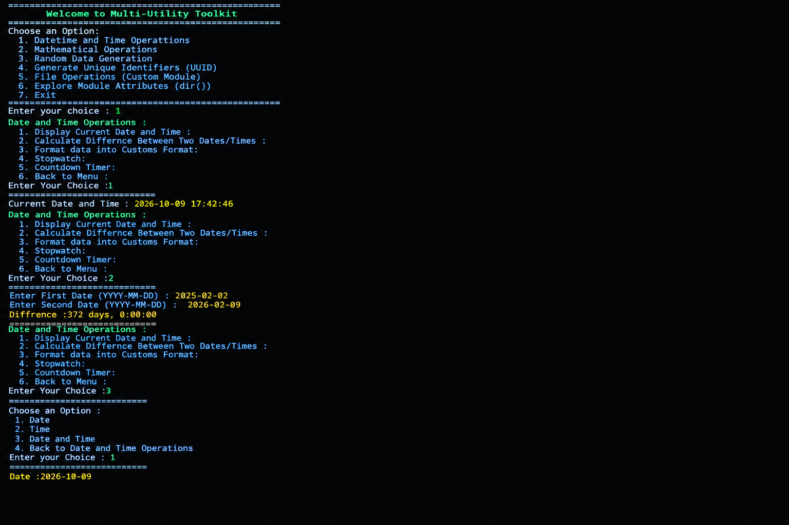

# Modular & Packager

A menu-driven Python program that brings several useful utilities together in one terminal application. The toolkit is organized into separate menus so users can choose an operation, enter the required information, and view the result.


Modular & Packager is a learning-focused project that shows how a Python
application can be split into reusable modules and organized into a package.
Instead of writing everything in one long file, the program keeps the main
menu in `main.py` and places specialized logic inside a `package/` folder.

The goals of the project are:

- Practice building interactive command-line programs.
- Learn how to split code into modules and packages.
- Use the Python standard library effectively.
- Work with Git and GitHub for version control.

## Features

### 1. Date and Time Operations
- Display the current date and time.
- Calculate the difference between two dates.
- Format date, time, or date-and-time output.
- Stopwatch.
- Countdown timer.

### 2. Mathematical Operations
- Provides a menu for mathematical utilities.
- Typical operations include basic arithmetic, powers, square roots,
  factorials, and other calculations from the `math` module.
- Implemented in `math_utilities.py`.

### 3. Random Data Generation
- Provides a menu for generating random data.
- Typical options include random integers, random floats, random choices
  from a list, and shuffling a sequence.
- Built on Python's `random` module.

### 4. Generate Unique Identifiers (UUID)
- Generate UUIDs (Universally Unique Identifiers).
- Useful for creating unique IDs for records, files, or sessions.
- Built on Python's `uuid` module.

### 5. File Operations (Custom Module)
- Access file-related operations implemented in a custom module.
- Typical operations include creating, reading, writing, appending to,
  and deleting files.
- Implemented in `file_utilities.py`.

### 6. Explore Module Attributes (`dir()`)
- Explore the attributes available in a Python module using `dir()`.
- Helps users discover the functions, classes, and constants a module offers.
- Implemented in `explore_modules.py`.

### 7. Exit
- Leave the application.

## Requirements

- Python 3.8 or newer
- VS Code (or any code editor)
- Git
- GitHub account (for hosting and sharing the project)

No third-party packages are required for the standard-library features,
unless your implementation uses additional dependencies.

## Installation

1. Install Python 3 from [python.org](https://www.python.org/downloads/)
   if it is not already installed.
2. Confirm the installation:

```bash
   python --version
```

3. Install Git from [git-scm.com](https://git-scm.com/) if needed.
4. Clone the repository:

```bash
   git clone https://github.com/your-username/your-repository.git
```

5. Move into the project folder:

```bash
   cd your-repository
```

## Getting Started

1. Open a terminal or command prompt in the project directory.
2. Run the main Python file:

```bash
   python main.py
```

   Replace `main.py` with the actual filename of your program if it is
   different. On some systems you may need to use `python3` instead.

3. The main menu appears. Choose an option by entering its number.

## How to Use

1. Start the program.
2. Choose an option from the main menu by entering its number.
3. Follow the prompts shown in the terminal.
4. For date-difference calculations, enter dates in `YYYY-MM-DD` format.
5. Use the menu's back option to return to the previous menu, or select
   **Exit** to quit.

## Menu Walkthrough

### Main Menu

```text
===== Modular & Packager =====
1. Date and Time Operations
2. Mathematical Operations
3. Random Data Generation
4. Generate Unique Identifiers (UUID)
5. File Operations
6. Explore Module Attributes (dir())
7. Exit
Enter your choice:
```

### Date and Time Menu

```text
1. Display current date and time
2. Calculate difference between two dates
3. Format date and time
4. Stopwatch
5. Countdown timer
6. Back
```

- **Stopwatch:** starts counting when you begin and reports the elapsed
  time when you stop it.
- **Countdown timer:** asks for a number of seconds and counts down to zero.

### Other Menus

The mathematical, random data, and file menus follow the same pattern:
a numbered list of options, a prompt for input, a printed result, and a
back option to return to the main menu.

## Examples

### Example: Date Difference

```text
Enter First Date (YYYY-MM-DD): 2025-02-02
Enter Second Date (YYYY-MM-DD): 2026-02-09
Difference: 372 days, 0:00:00
```

### Example: Current Date and Time

```text
Current Date and Time: 2026-10-09 17:42:46
```

The displayed date and time will depend on when and where the program is run.

### Example: Generating a UUID

```text
Generated UUID: 3f2b8c1e-5d4a-4b7e-9a6c-1e2f3a4b5c6d
```

Each run produces a different value.

### Example: Exploring a Module

```text
Enter module name: math
['acos', 'asin', 'atan', 'ceil', 'cos', 'e', 'factorial', 'floor', 'pi', ...]
```

## Project Structure

```text

├── package/
│   ├── explore_modules.py
│   ├── file_utilities.py
│   ├── __init__.py
│   └── math_utilities.py
│
├── main.py
├── output.png
└── README.md
```

Adjust the filenames above to match your actual project structure. If you
want Python to treat `package/` as a regular package, you can also add an
empty `__init__.py` file inside it.


### How the Modules Connect

`main.py` imports functions from the `package` folder, for example:

```python
from package import math_utilities
from package import file_utilities
from package import explore_modules
```

Each menu option then calls the matching function, which keeps `main.py`
short and easy to read.

## Input and Error Handling

- Enter menu numbers that correspond to the displayed options.
- Use the requested date format (`YYYY-MM-DD`) for date inputs.
- Invalid menu choices or malformed dates should be handled gracefully by
  the program. If they are not yet handled, consider adding input
  validation and helpful error messages.
- A `try`/`except` block around user input is a simple way to catch
  `ValueError` when someone types text instead of a number.
- When working with files, handle `FileNotFoundError` and
  `PermissionError` so the program does not crash.

## Concepts Demonstrated

Depending on the implementation, this project can demonstrate:

- Python menus and control flow
- Functions and modular programming
- Packages and imports
- Date and time handling with `datetime`
- Mathematical calculations
- Random-data generation
- UUID generation
- File operations
- Module introspection with `dir()`
- Version control with Git and GitHub

## Output



## Author

**Dal Adnan**